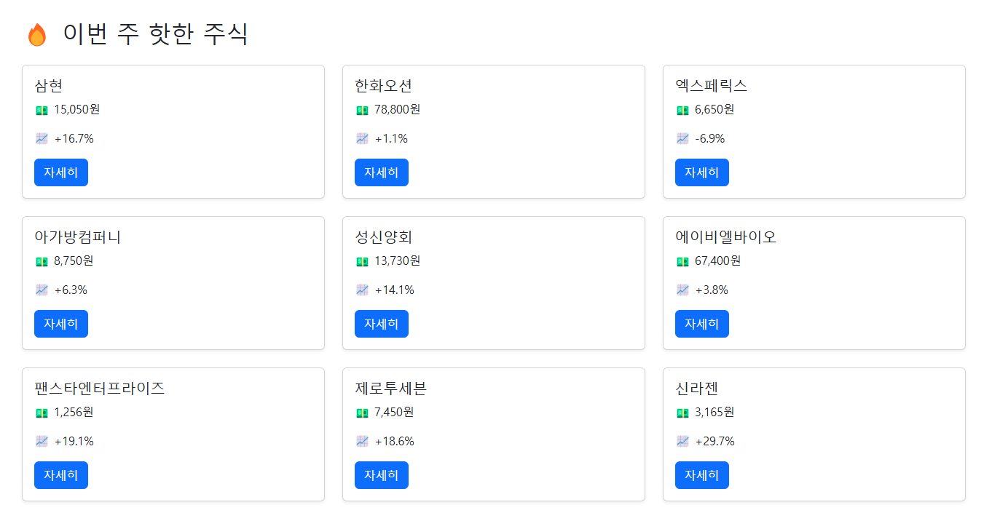
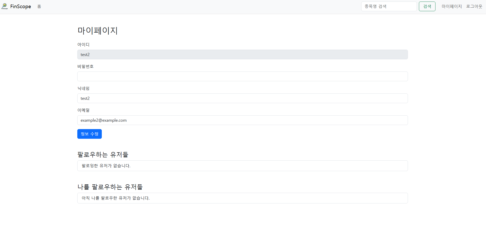
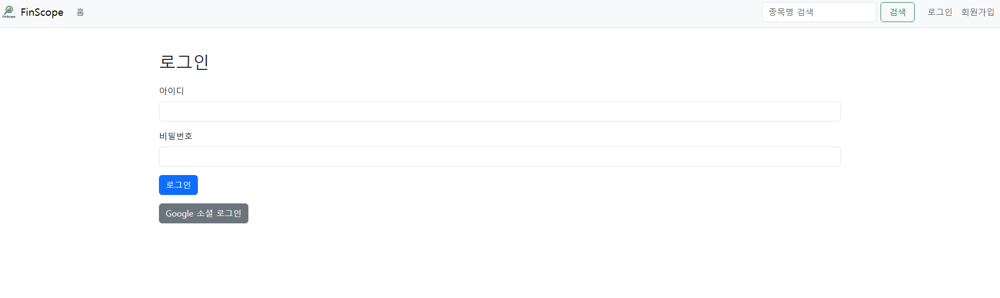

# 📘 FinScope

**FinScope**는 실시간 주식 정보, AI 기반 댓글 분석, 커뮤니티 기능, 즐겨찾기 및 소셜 로그인을 제공하는  
**풀스택 주식 분석 플랫폼**입니다.

이 프로젝트는 **백엔드(FinScope)**와 **프론트엔드(FinScope_front)**가 **분리된 Django 프로젝트**로 구성되어 있습니다.

---

## 🛠️ 주요 기능

| 기능 | 설명 |
|------|------|
| 🔥 핫한 주식 조회 | TossInvest에서 인기 주식 크롤링 및 리스트 출력 |
| 📈 상세 정보 페이지 | 종목명, 종목코드, 가격, 등락률, 차트 이미지 제공 |
| 💬 커뮤니티 댓글 | 종목별 댓글 CRUD |
| 🤖 AI 분석 | OpenAI GPT API로 댓글 분위기 분석 + “주식 온도” 시각화 |
| ⭐ 즐겨찾기 | 관심 종목 즐겨찾기 등록 |
| 👥 팔로우 | 다른 유저 팔로우 |
| 🔐 회원 기능 | 회원가입, JWT 로그인, 마이페이지 |
| 🔗 구글 로그인 | Google OAuth2 로그인 연동 |

---

## 📂 폴더 구조

```
.
├── FinScope/          # 백엔드 (Django REST API)
└── FinScope_front/    # 프론트엔드 (정적 HTML + JS, Django 템플릿 엔진 사용)
```

---

## 🖼️ 주요 페이지

### 🔻 1. 핫한 주식 리스트 (index)


### 🔻 2. 주식 상세 페이지


### 🔻 3. 마이페이지 (회원정보 수정, 팔로우 기능 포함)


### 🔻 4. 즐겨찾기한 주식


### 🔻 5. 로그인 (구글 소셜 로그인 포함)


---

## ⚙️ 실행 방법

### 1. 백엔드 실행 (FinScope)

```bash
cd FinScope
python -m venv venv
source venv/bin/activate
pip install -r requirements.txt
python manage.py migrate
python manage.py runserver  8001 # 백엔드 서버: http://127.0.0.1:8001
```

### 2. 프론트엔드 실행 (FinScope_front)

```bash
cd FinScope_front
python manage.py runserver  # 프론트 서버: http://127.0.0.1:8000
```

> 정적 페이지에서 백엔드 API(`http://127.0.0.1:8001/api/`)를 호출하는 구조입니다.

---

## 🔑 환경 변수 설정

`.env` 파일에 다음 항목을 설정해야 합니다:

```
OPENAI_API_KEY=your_openai_api_key
GOOGLE_CLIENT_ID=your_google_client_id
GOOGLE_CLIENT_SECRET=your_google_client_secret
```

---

## 🧑‍💻 개발자

- **Jake Lee**  
  GitHub: [https://github.com/OneArmedofLepanto](https://github.com/yourOneArmedofLepantoname)